<h3><code>parsa@github ~ $ whoami</code></h3>

<table>
<tr>
<td valign="top">
  
</td>
<td valign="top">
  
</td>
</tr>
</table>

  

<h3><code>parsa@github ~ $ ./contributions.sh</code></h3>

  

<h3><code>parsa@github ~ $ ./links.sh</code></h3>

<b>Software Engineering · Software Architecture · Security · Applied AI</b>

  

  <code>README UI generated from self-hosted SVGs · contribution art refreshed by GitHub Actions</code>

